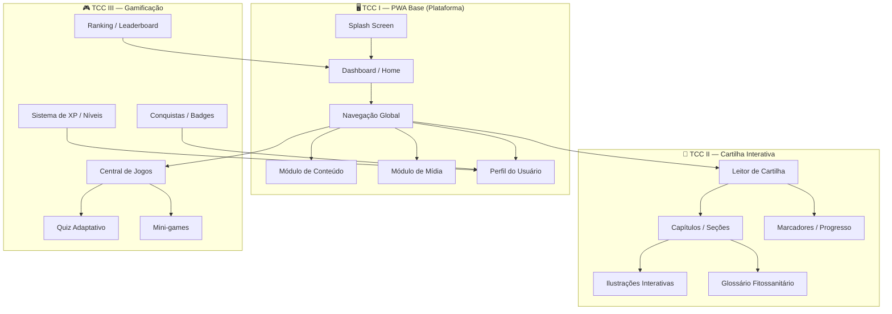
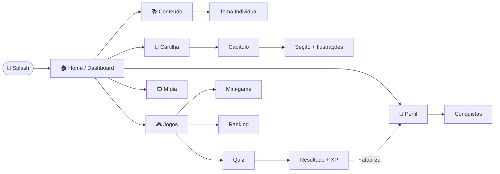
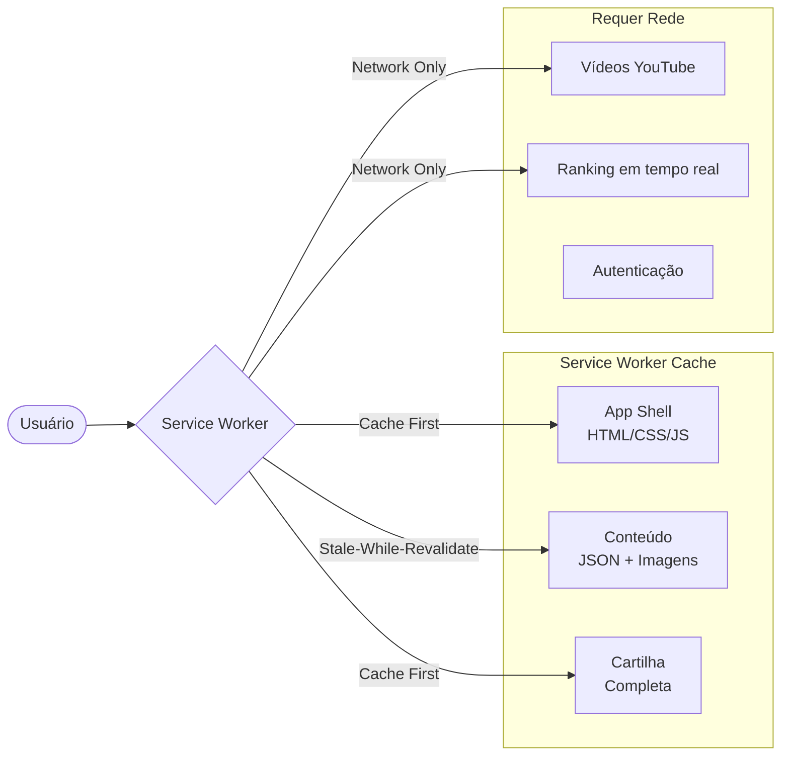

# 🌿 EducaFito — Arquitetura Front-End
**Stack:** Next.js 16 (App Router) · React 19 · Chakra UI v3 · TypeScript · PWA

---

## Visão Geral do Ecossistema



---

## Estrutura de Pastas

```
base/                                  ← raiz do projeto
├── app/                               ← Next.js App Router
│   ├── layout.tsx                     ← RootLayout (Chakra Provider, fontes, PWA meta)
│   ├── page.tsx                       ← Splash Screen
│   ├── globals.css                    ← tokens CSS globais + reset
│   │
│   ├── (auth)/                        ← Grupo de rotas sem layout de nav
│   │   ├── login/page.tsx
│   │   └── cadastro/page.tsx
│   │
│   ├── home/                          ← Dashboard principal
│   │   └── page.tsx
│   │
│   ├── conteudo/                      ── TCC I: Módulo de Conteúdo
│   │   ├── page.tsx                   ← Listagem de temas
│   │   ├── [slug]/page.tsx            ← Artigo/tema individual
│   │   └── [slug]/loading.tsx
│   │
│   ├── midia/                         ── TCC I: Módulo de Mídia
│   │   ├── page.tsx                   ← Feed de vídeos/posts
│   │   └── [id]/page.tsx
│   │
│   ├── cartilha/                      ── TCC II: Cartilha Interativa
│   │   ├── layout.tsx                 ← Layout do leitor (sidebar + viewer)
│   │   ├── page.tsx                   ← Índice / capa da cartilha
│   │   └── [capitulo]/
│   │       ├── page.tsx               ← Conteúdo do capítulo
│   │       └── [secao]/page.tsx       ← Seção individual
│   │
│   ├── jogos/                         ── TCC III: Gamificação
│   │   ├── layout.tsx                 ← Layout da central de jogos
│   │   ├── page.tsx                   ← Menu de jogos disponíveis
│   │   ├── quiz/
│   │   │   ├── page.tsx               ← Seleção de quiz
│   │   │   └── [id]/page.tsx          ← Sessão de quiz ativo
│   │   ├── mini-games/
│   │   │   └── [jogo]/page.tsx        ← Mini-game específico
│   │   └── ranking/page.tsx
│   │
│   ├── perfil/                        ── Perfil / progresso do usuário
│   │   ├── page.tsx
│   │   └── conquistas/page.tsx
│   │
│   └── api/                           ── API Routes (Next.js)
│       ├── conteudo/route.ts
│       ├── progresso/route.ts
│       └── ranking/route.ts
│
├── components/                        ← Componentes reutilizáveis
│   ├── ui/                            ← Chakra UI snippets 
│   │   ├── provider.tsx               ← ChakraProvider + ColorMode
│   │   ├── color-mode.tsx
│   │   ├── toaster.tsx
│   │   └── tooltip.tsx
│   │
│   ├── layout/                        ← Estrutura de página
│   │   ├── AppShell.tsx               ← Shell com nav lateral + header
│   │   ├── BottomNav.tsx              ← Navegação mobile (PWA)
│   │   ├── TopBar.tsx                 ← Header com XP, avatar, notificações
│   │   └── Sidebar.tsx                ← Menu lateral (desktop)
│   │
│   ├── conteudo/                      ── TCC I
│   │   ├── CardTema.tsx               ← Card de tema (fitopatologia, entomologia…)
│   │   ├── ArticleViewer.tsx          ← Renderizador de conteúdo MDX/rich-text
│   │   ├── NivelBadge.tsx             ← Badge de nível (básico/intermediário/avançado)
│   │   └── TagFiltro.tsx
│   │
│   ├── midia/                         ── TCC I
│   │   ├── VideoCard.tsx              ← Card de vídeo YouTube
│   │   ├── PostCard.tsx               ← Card de publicação/artigo
│   │   └── MediaFeed.tsx              ← Feed scrollável
│   │
│   ├── cartilha/                      ── TCC II
│   │   ├── CartilhaSidebar.tsx        ← Sumário navegável
│   │   ├── PageViewer.tsx             ← Visualizador de página (flip animation)
│   │   ├── IllustrationHotspot.tsx    ← Ilustração com pontos interativos
│   │   ├── GlossarioPopover.tsx       ← Tooltip de glossário in-line
│   │   ├── ReadingProgress.tsx        ← Barra de progresso de leitura
│   │   └── BookmarkButton.tsx
│   │
│   ├── gamificacao/                   ── TCC III
│   │   ├── QuizCard.tsx               ← Card de questão do quiz
│   │   ├── QuizTimer.tsx              ← Timer animado
│   │   ├── ResultadoModal.tsx         ← Modal de fim de quiz com XP ganho
│   │   ├── XPBar.tsx                  ← Barra de experiência animada
│   │   ├── RankingTable.tsx           ← Tabela de ranking
│   │   ├── ConquistaCard.tsx          ← Badge de conquista
│   │   └── GameCard.tsx               ← Card de mini-game disponível
│   │
│   └── shared/                        ← Compartilhados entre módulos
│       ├── LoadingSpinner.tsx
│       ├── EmptyState.tsx
│       ├── ErrorBoundary.tsx
│       ├── OfflineBanner.tsx          ← Aviso de modo offline
│       └── ProgressRing.tsx           ← Anel de progresso circular
│
├── lib/                               ← Lógica de negócio / utilitários
│   ├── api/
│   │   ├── conteudo.ts                ← Fetch de conteúdo
│   │   ├── progresso.ts               ← Fetch de progresso do usuário
│   │   └── ranking.ts
│   ├── hooks/
│   │   ├── useOffline.ts              ← Detecta conexão
│   │   ├── useProgresso.ts            ← Progresso de leitura/curso
│   │   ├── useGamificacao.ts          ← Estado de XP e conquistas
│   │   └── useQuiz.ts                 ← Lógica de sessão de quiz
│   ├── store/
│   │   └── userStore.ts               ← Estado global (Zustand ou Context)
│   ├── pwa/
│   │   ├── sw-register.ts             ← Registro do Service Worker
│   │   └── cache-strategy.ts          ← Estratégias de cache (conteúdo offline)
│   └── utils/
│       ├── formatters.ts
│       └── validators.ts
│
├── data/                              ← Dados estáticos / mock
│   ├── temas.json                     ← Temas fitossanitários
│   ├── cartilha/
│   │   ├── capitulos.json
│   │   └── glossario.json
│   └── jogos/
│       ├── quizzes.json
│       └── minigames.json
│
├── public/
│   ├── manifest.json                  ← PWA manifest
│   ├── sw.js                          ← Service Worker
│   ├── icons/                         ← Ícones PWA (192, 512px)
│   └── images/
│       ├── cartilha/                  ← Ilustrações da cartilha
│       └── jogos/                     ← Assets dos mini-games
│
├── styles/
│   └── tokens.css                     ← Design tokens (cores, espaçamento, tipografia)
│
└── types/                             ← Tipos TypeScript globais
    ├── conteudo.ts
    ├── cartilha.ts
    ├── gamificacao.ts
    └── usuario.ts
```

---

## Mapeamento TCC × Módulos

| TCC | Foco Acadêmico | Rotas Principais | Componentes-chave |
|-----|---------------|-----------------|-------------------|
| **TCC I** | PWA Base + Conteúdo + Mídia | `/home`, `/conteudo`, `/midia`, `/perfil` | `AppShell`, `CardTema`, `ArticleViewer`, `MediaFeed`, `OfflineBanner` |
| **TCC II** | Cartilha Interativa | `/cartilha`, `/cartilha/[capitulo]` | `PageViewer`, `IllustrationHotspot`, `GlossarioPopover`, `CartilhaSidebar` |
| **TCC III** | Gamificação + Quiz + Ranking | `/jogos`, `/jogos/quiz`, `/jogos/ranking` | `QuizCard`, `XPBar`, `RankingTable`, `ConquistaCard`, `ResultadoModal` |

---

## Sistema de Design (Chakra UI v3)

```typescript
// lib/theme.ts — tokens personalizados do EducaFito
const theme = {
  colors: {
    brand: {
      50:  '#f0fdf4',  // fundo claro
      100: '#dcfce7',
      300: '#6ee7b7',
      500: '#34d399',  // verde principal (já usado no splash)
      700: '#059669',
      900: '#064e3b',
    },
    soil: {             // paleta "terra" para contexto rural'
      100: '#fef3c7',
      500: '#d97706',
      900: '#78350f',
    },
    dark: {             // modo escuro — padrão da plataforma
      bg:      '#0f2027',
      surface: '#1a3a2a',
      card:    '#1e4535',
      border:  '#2d6a4f',
    }
  },
  fonts: {
    heading: 'Inter, system-ui, sans-serif',
    body:    'Inter, system-ui, sans-serif',
    mono:    'Geist Mono, monospace',
  },
  radii: {
    card: '16px',
    badge: '999px',
  }
}
```

---

## Fluxo de Navegação



---

## Estratégia PWA / Offline



**Prioridades de cache:**
- `Cache First` → App Shell, cartilha, imagens estáticas
- `Stale-While-Revalidate` → Conteúdo educacional (atualiza em bg)
- `Network Only` → Vídeos, ranking ao vivo, autenticação

---

## Convenções de Código

### Nomenclatura de Arquivos
| Tipo | Convenção | Exemplo |
|------|-----------|---------|
| Páginas | `page.tsx` | `app/jogos/quiz/[id]/page.tsx` |
| Layouts | `layout.tsx` | `app/cartilha/layout.tsx` |
| Componentes | `PascalCase.tsx` | `QuizCard.tsx` |
| Hooks | `useNome.ts` | `useQuiz.ts` |
| Utilitários | `camelCase.ts` | `formatters.ts` |
| Tipos | `nome.ts` (singular) | `gamificacao.ts` |

### Padrão de Componente
```tsx
// components/gamificacao/QuizCard.tsx
'use client'

import { Box, Text } from '@chakra-ui/react'
import type { Questao } from '@/types/gamificacao'

interface QuizCardProps {
  questao: Questao
  onResponder: (alternativa: string) => void
}

export function QuizCard({ questao, onResponder }: QuizCardProps) {
  // ...
}
```

### Imports — Ordem Padrão
```typescript
// 1. React / Next
import { useState } from 'react'
import { useRouter } from 'next/navigation'

// 2. Bibliotecas externas (Chakra, react-icons…)
import { Box, Button } from '@chakra-ui/react'

// 3. Componentes internos
import { XPBar } from '@/components/gamificacao/XPBar'

// 4. Hooks / lib
import { useGamificacao } from '@/lib/hooks/useGamificacao'

// 5. Tipos
import type { Usuario } from '@/types/usuario'
```

---

## Roadmap por TCC

### TCC I — PWA Base *(prioridade imediata)*
- [x] Splash Screen
- [x] Página Home (esqueleto)
- [x] `layout.tsx` com Chakra Provider + metadados PWA
- [x] `AppShell` (TopBar + BottomNav mobile)
- [ ] Módulo de Conteúdo (`/conteudo`)
- [ ] Módulo de Mídia (`/midia`)
- [ ] Página de Perfil básico
- [ ] `manifest.json` + Service Worker
- [ ] Modo offline para conteúdo

### TCC II — Cartilha Interativa
- [ ] Leitor de cartilha com flip animation
- [ ] Ilustrações com hotspots interativos
- [ ] Glossário inline com Chakra `Popover`
- [ ] Progresso de leitura persistido (localStorage)
- [ ] Modo offline completo para a cartilha

### TCC III — Gamificação
- [ ] Sistema de XP e níveis
- [ ] Quiz adaptativo (por nível de dificuldade)
- [ ] Mini-games (Identificação de Pragas, etc.)
- [ ] Ranking local + global
- [ ] Sistema de conquistas / badges
- [ ] Notificações de progresso

---

## Decisões de Arquitetura & Justificativas

| Decisão | Escolha | Motivo |
|---------|---------|--------|
| Roteamento | App Router (Next.js 16) | Server Components + layouts aninhados nativos |
| UI Library | Chakra UI v3 | Componentes acessíveis, dark mode nativo, design system flexível |
| Estado global | React Context + `useReducer` (ou Zustand) | Leve para a fase atual; escalável |
| Dados educacionais | JSON estático → CMS progressivo | Simplicidade no TCC I; escala nos TCCs II/III |
| Fontes | Inter (Google Fonts via Next.js) | Legibilidade + consistência com design atual |
| Offline | next-pwa + Service Worker | Essencial para escolas rurais com conectividade limitada |
| Estilo | Chakra + CSS Modules para casos específicos | Evita conflito Tailwind × Chakra |

> [!TIP]
> Para o contexto de **Região Norte / escolas rurais**, priorize:
> - Imagens comprimidas (WebP)
> - Carregamento lazy de vídeos
> - Conteúdo crítico 100% offline-first
> - Interface acessível (contraste AAA, fontes legíveis)